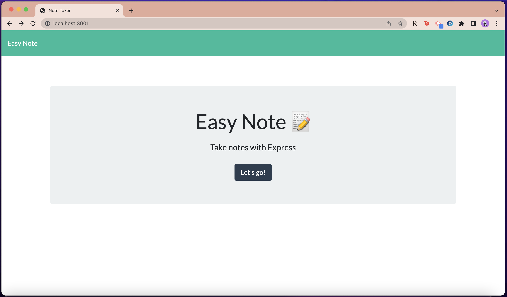

# Easy Note

## Description

This application allows the user to take notes and store them within a database. Notes can be posted to the database and retrieved later. When the user clicks on the "Get Started" button, they are taken to another page where they can enter a title for their note as well as the note itself. Easy Note is deployed on Heroku - feel free to check out the link below!  

## Screenshot

## Links 
Github repo: https://github.com/stephtf/easy-note.git
App on Heroku: https://easy-note-3001.herokuapp.com/ 

## Questions 

If you have any questions about the repo, open an issue or contact me directly at stfajardo@gmail.com. You can find more of my work at [stephtf](https://github.com/stephtf/) or by visiting my website at [https://www.stephfajardo.com](https://www.stephfajardo.com).
